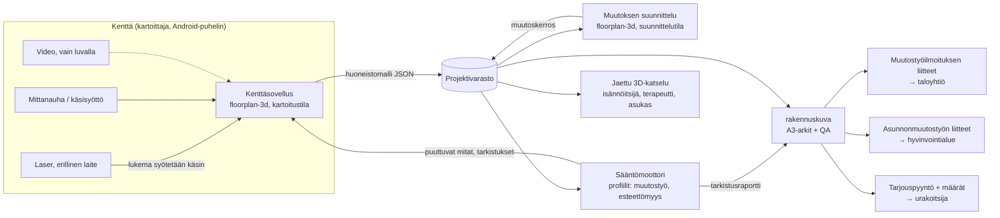

# Kodin muutostyökuva — arkkitehtuuri

Tila: suunnitteludokumentti, luonnos 2 (K1–K3 päätetty), V0 §6.4 ja V1.1 §6.5
Päivä: 2026-09-30
Toteutuksen tarkistuslista: [CHECKLIST.md](CHECKLIST.md)

Tämä dokumentti kuvaa, miten kolmesta olemassa olevasta palasta rakennetaan yksi
palvelu, joka tuottaa asunnon muutostöihin tarvittavat kuvat ja tarkistukset:

| Pala | Repo | Mitä se tuo |
|---|---|---|
| Interaktiivinen 2D/3D-editori | `jaakjuu1/floorplan-3d` (tämä repo) | Pohjapiirroksen muokkaus, seinien purku, kantavat seinät, kalusteet, 3D-kävely törmäystarkistuksella, kustannusarvio, kosketuskäyttö |
| Semanttinen rakennusmalli ja viranomaiskuvat | `jaakjuu1/rakennuspiirustus-automaatio` (`rakennuskuva`) | Mittausten alkuperäketju (status, menetelmä, tarkkuus, kuittaaja), virallisen tulosteen estologiikka, A3-arkit (SVG/PDF) ja QA-JSON |
| Parametrinen generointi ja esitys | `achrefelouafi/ProceduralBuildingsThreeJS` (ulkoinen, MIT) | Ideat: parametrinen malli → monta instanssia, valaistus, kuvakulmat, ympäristön massamalli. Ei koodiriippuvuutta |

---

## 1. Tausta ja tavoite

### 1.1 Ongelma

Sama asunnon muutostyö tarvitsee usein useamman erillisen paperin eri vastaanottajille:

- **Taloyhtiö** tarvitsee osakkaan muutostyöilmoituksen, kun työ voi vaikuttaa
  rakenteisiin, vedeneristykseen, putkistoihin, ilmanvaihtoon tai muihin osakkaisiin
  (asunto-osakeyhtiölaki, 5 luku).
- **Hyvinvointialue** tarvitsee asunnonmuutostyöhakemuksen liitteineen, kun kotia
  muutetaan esteettömäksi (esim. kynnysten poisto, oviaukon levennys, tukikahvat).
- **Urakoitsija** tarvitsee mitat ja työn kuvauksen tarjousta varten.

Nykyään jokainen paperi tehdään erikseen, eri ihmisen toimesta ja eri piirroksella.
Mittaukset tehdään useaan kertaan, eikä kenelläkään ole yhteistä, ajantasaista kuvaa
asunnosta.

### 1.2 Ratkaisu yhdellä lauseella

**Yksi mitattu huoneistomalli, johon muutos piirretään kerran ja josta tulostetaan
jokaiselle vastaanottajalle oma paperi ja tarkistus.**

### 1.3 Ensisijaiset käyttötapaukset

1. **Muutostyöilmoitus** (kerrostalo): esim. kylpyhuoneremontti, väliseinän purku,
   keittiön siirto.
2. **Esteettömyyden asunnonmuutostyö**: kynnysten poisto, oviaukon levennys, WC:n ja
   suihkun muutos, tukikahvat, kääntötila pyörätuolille.
3. **Molemmat yhtä aikaa**: tyypillinen tapaus, esim. esteettömyyskylpyhuone
   kerrostalossa. Tämä on palvelun ydin.

### 1.4 Rajaukset (ei tässä vaiheessa)

- Rakennuslupaa vaativat muutokset ja pääsuunnittelijan tehtävät. Järjestelmä tuottaa
  luonnoksia ja liitteitä, ei korvaa kelpoista suunnittelijaa.
- LVI-, sähkö- ja rakennesuunnittelu. Järjestelmä *liputtaa* kohdat, joihin tarvitaan
  asiantuntija, mutta ei suunnittele niitä.
- Pihasaunaidea ja muut käyttötapaukset. Arkkitehtuuri pidetään niille avoimena
  (ks. luku 13), mutta niitä ei toteuteta nyt.
- Sähköinen asiointi viranomaisten järjestelmiin. Aluksi tulosteet ovat PDF-liitteitä.

---

## 2. Periaatteet

1. **Yksi semanttinen malli, monta näkymää.** Sama periaate kuin
   `rakennuskuva/docs/architecture/11-drawing-contract.md`: kuvat johdetaan mallista,
   niitä ei piirretä erikseen.
2. **Laser ensin, video vain luvalla.** Malli on oltava valmis pelkillä laser- ja
   mittanauhamittauksilla. Video on vapaaehtoinen rikastava kerros, joka otetaan vain
   asukkaan suostumuksella.
3. **Jokaisella mitalla on alkuperä.** Arvo, status (`measured` / `inferred` /
   `assumed`), menetelmä, lähde, tarkkuus ja kuittaaja. Ei nimettömiä numeroita.
4. **Säännöt ohjaavat mittaamista.** Valittu käyttötapaus (profiili) kertoo, mitkä
   mitat ovat kriittisiä ja millä tarkkuudella. Kenttäsovellus pyytää ne paikan päällä.
5. **Nykytila on muuttumaton, muutos on erillinen kerros.** Muutoskuva on nykytilan ja
   muutoksen ero, ei käsin väritetty kopio.
6. **Luonnos ei naamioidu viralliseksi.** Kuten `rakennuskuva`: jos kriittiset mitat
   puuttuvat tai ovat arvioita, tuloste on merkitty luonnokseksi ja estolista näkyy.
7. **Terveystietoa ei tallenneta malliin.** Malliin tallennetaan vain tilan
   vaatimukset (esim. "pyörätuoli, leveys 700 mm"), ei diagnooseja tai toimintakyvyn
   kuvausta (ks. luku 10).

---

## 3. Nykytila: mitä on jo olemassa ja mitä puuttuu

Luku 3 kuvaa suunnittelun lähtötilannetta ennen V0:aa (commit `859a40f`; rivi­viittaukset
koskevat sitä versiota). V0:n toteutunut rakenne
ja tietovirta kuvataan §6.4:ssä ja valmistuminen tarkistuslistassa.

### 3.1 floorplan-3d

Olemassa (`index.html`, yksi tiedosto, ~2 700 riviä, Three.js r160):

- 2D-pohja SVG:nä, mitat millimetreinä, mittatyökalu, seinien purku ja kantavien
  seinien merkintä (`WALLS`, `index.html:399`), kalustekirjasto (`LIB`), huonekohtaiset
  lattiamateriaalit ja kustannusarvio.
- 3D-näkymä: kiertokamera, kävelytila, ovien avaus, törmäystarkistus
  (`blocked()`, `index.html:2593`, säde 0,22 m), aurinko/yö.
- Kosketuskäyttö ja tabletti (`COARSE`-haarat, virtuaalinen ohjaussauva).
- Tila `localStorage`ssa (`huxing-design-v1`) ja JSON-vienti/tuonti (vain kalusteet,
  huonemateriaalit, puretut seinät ja mittaukset).

Puuttuu:

- **Pohjapiirros on kovakoodattu.** `ROOMS`, `WALLS`, `WINS`, `DOORS`, `SLIDES` ovat
  vakioita (`index.html:399–462`). Uutta asuntoa ei voi luoda eikä tuoda.
- Seinät ovat akselinsuuntaisia suorakaiteita `[x0,y0,x1,y1,tyyppi]`. Vinoja seiniä
  ei tueta.
- Kynnyksiä, märkätilan rajoja, oviaukon vapaata leveyttä ja kiintokalusteiden
  vapaatiloja ei mallinneta.
- Mittauksilla ei ole alkuperää eikä tarkkuutta.
- Koordinaatisto: x oikealle, **y alaspäin** (SVG). `rakennuskuva` käyttää y:tä
  pohjoiseen eli ylöspäin.

### 3.2 rakennuskuva

Olemassa (`src/rakennuskuva/`, Python, Pydantic, 39 testiä):

- `Measurement` (`input_models.py`): `value_mm`, `status`, `method`, `source_refs`,
  `confidence_mm`, `confirmed_by`, `note` ja `official_release_blocker()`.
- `ProjectInputs.official_release_blockers()`: virallinen tuloste estyy, jos
  kriittinen mitta ei ole `measured`, tarkkuus ylittää 50 mm tai metatiedot puuttuvat.
- A3-renderöijät: pohja, leikkaukset A–A ja B–B, julkisivut, SVG + PDF + QA-JSON.
- CLI `rakennuskuva` / `rk`: `validate`, `floor-plan`, `section`, `elevation`, `all`.

Puuttuu tätä käyttötapausta varten:

- **Malli on rakennustasoinen ja ulkokuoripainotteinen.** `BuildingInput` olettaa
  suorakaiteen ulkomitat, pulpettikaton (`RoofInput.type: "shed"`) ja seinät
  ilmansuunnittain (`WallInput.side`). Huoneet ovat akselinsuuntaisia suorakaiteita,
  kalustetyyppejä on viisi.
- Huoneistotasoa (kerrostaloasunto osana isompaa rakennusta) ei ole.
- Muutoskuvaa (nykytila vs. muutos) ei ole arkkityyppinä.
- `method` on vapaa merkkijono, joten sääntö ei voi vaatia tiettyä menetelmää.
- Tarkkuusraja on yksi globaali arvo (50 mm). Esteettömyys tarvitsee mittakohtaiset
  rajat.
- CLI riippuu esimerkkiprojektin `architectural_model`-moduulista
  (`cli.py: _ensure_semantic_path`).

### 3.3 Johtopäätös

Kumpaakaan nykyistä tietomallia ei voi käyttää sellaisenaan. Tarvitaan **uusi
huoneistotason skeema**, joka lainaa `rakennuskuva`n mittausmallin ja
`floorplan-3d`:n editorin, ja jota kumpikin repo lukee ja kirjoittaa.

---

## 4. Järjestelmän yleiskuva



### 4.1 Komponentit

| # | Komponentti | Toteutus | Vastuu |
|---|---|---|---|
| C1 | **Huoneistomalli** (skeema) | JSON Schema + Pydantic (`rakennuskuva`) + JS-lukija/kirjoittaja (`floorplan-3d`) | Yhteinen sopimus kaikkien osien välillä |
| C2 | **Kenttäsovellus** | `floorplan-3d`, uusi kartoitustila | Huoneiden muoto, mittojen käsisyöttö puhelimella, reaaliaikainen 2D/3D-esikatselu, puuttuvien mittojen lista |
| C3 | **Suunnittelutila** | `floorplan-3d`, nykyinen editori laajennettuna | Muutoskerroksen piirtäminen, 3D, pyörätuolisimulaatio, kustannukset |
| C4 | **Sääntömoottori** | Deklaratiiviset säännöt (JSON) + arvioijat Pythonissa, esikatselu JS:ssä | Kriittiset mitat, tarkistukset, estot |
| C5 | **Tulosteet** | `rakennuskuva`, uudet arkkityypit | A3-muutoskuva, esteettömyysliite, määräluettelo, QA-JSON |
| C6 | **Projektivarasto** | MVP: tiedostot (JSON + liitteet). Myöhemmin: palvelin | Versiot, roolit, suostumukset, säilytysajat |
| C7 | **Jaettu katselu** | `floorplan-3d` vain luku -tilassa | Linkki isännöitsijälle, terapeutille ja urakoitsijalle |
| C8 | **Videoputki** (valinnainen) | Erillinen palvelu, vain suostumuksella | Stillkuvat mittojen lähteiksi, päätelty lisägeometria |
| C9 | **Ulkoiset rajapinnat** | Adapterit | MML, HTJ, rakennustiedot, piirustusarkistot (luku 11) |

---

## 5. Huoneistomalli (C1)

### 5.1 Skeeman paikka ja versiointi

- Uusi skeema `unit-input-v1` (huoneisto), rinnakkain nykyisen
  `project-input-v2`:n kanssa. Nykyistä skeemaa ei rikota.
- Kanoninen määrittely Pydanticina `rakennuskuva`ssa, josta generoidaan
  `schemas/unit-input-v1.schema.json` samalla tavalla kuin nykyinen skeema.
- `floorplan-3d` lukee ja kirjoittaa samaa JSONia. Skeemasta kopio tähän repoon
  (`schemas/`) ja CI-tarkistus, että kopiot eivät eriydy (vrt. `rakennuskuva`n
  `tools/sync_skills.py --check`).
- `schema_version` pakollinen. Muutokset vain uuden version kautta.

V0 toteutetaan osissa; ensimmäinen osuus ja käyttäjän sallima eteneminen vaiheen
−1 keskeneräisyydestä huolimatta on rajattu [V0-SOPIMUS.md](V0-SOPIMUS.md):ssä.
Uusi `Measurement` on erillinen vanhasta project-input-v2-mallista, jotta sen
olemassa olevat tuonnit säilyvät yhteensopivina. `unit-v1` hylkää tuntemattomat
kentät ja validoi myös elementtien viittaukset. Aikaleimat säilyvät alkuperäisessä
RFC3339-merkkijonomuodossa aikavyöhykkeineen; tuntematon tarkkuus on `null`.

### 5.2 Koordinaatisto

- Yksikkö millimetri. Paikallinen koordinaatisto huoneistolle.
- **x oikealle, y ylöspäin** (sama kuin `rakennuskuva`). `floorplan-3d` kääntää
  y-akselin näytössä. Kääntö tehdään yhdessä paikassa (tuonti/vienti), ei ympäri
  koodia.
- Valinnainen `north_deg` (pohjoisnuolen suunta) aurinkotarkasteluja ja
  asemapiirrosta varten.
- Korkeudet (z) lattiapinnasta, ellei `height_system` ole annettu.

### 5.3 Mittaus (`Measurement`)

Otetaan `rakennuskuva`n malli sellaisenaan ja tarkennetaan kahta kenttää:

```jsonc
{
  "value_mm": 842,
  "status": "measured",            // measured | inferred | assumed
  "method": "laser",               // UUSI: luettelo, ks. alla
  "source_refs": ["survey:2026-10-02/m-017", "photo:kph-ovi-01.jpg"],
  "confidence_mm": 2,
  "confirmed_by": "kartoittaja:mv",
  "captured_at": "2026-10-02T10:14:00+03:00",   // UUSI
  "device": "laser, kartoittajan oma",          // UUSI, valinnainen vapaa teksti
  "note": "vapaa leveys karmien välistä"
}
```

`method`-luettelo:

| Arvo | Käyttö | Tyypillinen status |
|---|---|---|
| `laser` | Laseretäisyysmittari | `measured` |
| `tape` | Mittanauha, rullamitta, rakotulkki (kynnykset, pienet mitat) | `measured` |
| `lidar_scan` | Puhelimen LiDAR-skannaus | `inferred` |
| `video` | Videosta johdettu geometria | `inferred` |
| `archive_drawing` | Arkistopiirustuksesta luettu | `inferred` |
| `registry` | Ulkoisesta rekisteristä (esim. MML:n kiinteistörajat) | `inferred` |
| `derived` | Laskettu muista mitoista (esim. suljettu monikulmio) | perii heikoimman lähteen statuksen |
| `assumption` | Oletus (esim. tyypillinen seinäpaksuus) | `assumed` |

Siirtymä: `rakennuskuva`n nykyinen vapaa `method`-kenttä kuvataan luetteloon
tuonnissa (`vision_estimate` → `video`, `drawing_assumption` → `assumption` jne.).

### 5.4 Rakenne-elementit

```text
UnitInputs
├── schema_version: "unit-v1"
├── project        (id, nimi, osoite, kunta, kiinteistötunnus?, huoneistotunnus?)
├── building_ref   (taloyhtiö, rakennusvuosi?, kerros, porras; ulkoisista lähteistä)
├── survey         (kartoitus: kuka, milloin, laitteet, suostumukset, ks. 5.7)
├── baseline       (nykytila)
│   ├── walls[]        seinä = keskilinja (a, b) + paksuus + tyyppi
│   ├── openings[]     aukko seinässä: ovi / ikkuna / aukko, sijainti seinällä
│   ├── rooms[]        huone = monikulmio + nimi + tyyppi (märkätila, keittiö…)
│   ├── fixtures[]     kiintokalusteet: WC, lavuaari, suihku, amme, liesi, kaapit
│   ├── thresholds[]   kynnykset ja tasoerot (aukkoon tai huonerajaan sidottu)
│   └── measurements[] raakamittaukset, joihin elementit viittaavat
├── changes[]      (muutoskerros, ks. 5.6)
├── profiles[]     (käytössä olevat sääntöprofiilit, ks. luku 7)
└── documents      (vastaanottajat, suunnittelija, revisio)
```

Elementit:

| Elementti | Kentät (ydin) | Huomiot |
|---|---|---|
| `Wall` | `id`, `a:{x,y}`, `b:{x,y}`, `thickness`, `kind` (`load_bearing` / `partition` / `external` / `party` = huoneistojen välinen), `wet_side?` | Keskilinjamalli tukee vinoja seiniä. Jokainen koordinaatti ja paksuus on `Measurement`. `kind: load_bearing` vaatii lähteen (arkistopiirustus, isännöitsijä), koska sitä ei voi mitata |
| `Opening` | `id`, `kind` (`door` / `sliding_door` / `window` / `opening`), `host_wall`, `along_wall`, `width` (karmiaukko), `clear_width` (vapaa kulkuleveys), `height`, `sill_z`, `swing` | `clear_width` on esteettömyyden kriittinen mitta, erillinen karmiaukosta |
| `Room` | `id`, `name`, `kind` (`wet`, `sauna`, `kitchen`, `bedroom`, `living`, `hall`, `storage`, `wc`, `balcony`), `polygon` | Pinta-ala lasketaan, ei syötetä. `kind: wet` laukaisee märkätilasäännöt |
| `Fixture` | `id`, `kind`, `x`, `y`, `width`, `depth`, `rotation_deg`, `height?`, `clearance?` | WC:n vapaa tila sivuilla on esteettömyyden kriittinen mitta |
| `Threshold` | `id`, `at_opening?` tai `between_rooms?`, `height` (mm), `kind` (`threshold` / `step` / `slope`) | Mitataan aina `tape`-menetelmällä |
| `Measurement` (raaka) | `id`, `from`, `to` (viittaukset pisteisiin tai elementteihin), arvo ja alkuperä | Raakamitat säilytetään, jotta geometria voidaan laskea uudelleen ja ristiintarkistaa |

### 5.5 Raakamittauksista geometriaksi

Kenttäsovellus tallentaa **raakamittaukset** (etäisyys A:sta B:hen) ja **luonnoksen**
(huoneen muoto). Geometria lasketaan niistä:

1. Luonnos antaa topologian: mitkä seinät rajaavat huonetta ja missä järjestyksessä.
2. Seinämitat asetetaan luonnokselle. Suorakulmaisuus oletetaan, ellei vinoutta ole
   merkitty.
3. **Sulkeutumistarkistus:** huoneen kehä pitää sulkeutua. Poikkeama raportoidaan
   (esim. "lävistäjä poikkeaa 14 mm odotetusta").
4. Jos huoneesta on mitattu lävistäjä, suorakulmaisuus tarkistetaan ja kulma
   korjataan.
5. Huoneet liitetään toisiinsa yhteisten seinien ja aukkojen kautta. Seinäpaksuus
   saadaan aukon kohdalta mitattuna (karmisyvyys) tai oletuksena (`assumed`).
6. Johdettujen arvojen status on heikoin lähteiden statuksista (`derived`).

### 5.6 Muutoskerros

Nykytila (`baseline`) lukitaan, kun kartoitus hyväksytään. Muutokset ovat listana
operaatioita:

```jsonc
{ "op": "demolish_wall",   "target": "w-12" }
{ "op": "add_wall",        "wall": { /* uusi Wall */ } }
{ "op": "modify_opening",  "target": "o-4", "set": { "clear_width": { "value_mm": 900, "status": "assumed", "method": "assumption", "source_refs": ["design:door-width"], "confidence_mm": null }, "swing": "right" } }
{ "op": "remove_threshold","target": "t-2" }
{ "op": "add_fixture",     "fixture": { "kind": "grab_bar", /* … */ } }
{ "op": "replace_fixture", "target": "f-7", "fixture": { /* … */ } }
{ "op": "change_finish",   "room": "r-kph", "floor": "tile_antislip", "walls": "tile" }
```

- Tavoitetila = `apply(baseline, changes)`. Laskenta on deterministinen ja sama
  molemmissa repoissa (yhteiset testitapaukset, luku 12).
- Myös muutosoperaatioiden pituudet ovat `Measurement`-olioita: suunniteltu mitta
  ei ole kentällä mitattu arvo. `apply` palauttaa uuden mallin muuttamatta
  lähtömallia tai operaatiolistaa. Purku poistaa tavoitetilasta seinän aukot,
  niihin sidotut kynnykset ja poistettuihin elementteihin viittaavat raakamitat.
  Lähtömallin mittaushistoria säilyy. Kalusteen korvaus säilyttää kohteen id:n.
- V0:n ensimmäisessä osuudessa raakamitan `from`/`to` viittaavat elementtien
  id:ihin. Erillinen pisteiden tunnistemalli kuuluu raakamittageometrian toteutukseen.
- Muutoskuvan värit johdetaan operaatioista: purettava keltaisella, uusi punaisella,
  muuttuva korostettuna. Suomalainen käytäntö, tarkistetaan viranomais- ja
  isännöitsijäpohjista ennen toteutusta.
- `floorplan-3d`:n nykyinen `state.demolished` on käytännössä muutoskerroksen
  esiaste. Se korvataan `changes`-listalla.

**Muutosten muokkaus 2026-10-03 (työpöytä ensin):** `src/model/edit.ts` on ainoa
tie muutoskerrokseen: `demolishWall`, `restoreWall`, `addWall`, `modifyOpening`,
`removeThreshold`, `setFloor`, `addFixture`, `replaceFixture` ja `revertChange`.
Jokainen palauttaa irrotetun, `parseUnit` + `apply` -validoidun mallin, jossa on
täsmälleen yksi uusi tai poistettu operaatio. Suunnitellut mitat ovat
`assumed`/`assumption`, viite `design:<id>/<kenttä>`. Kantavaa, ulko- tai
huoneistojen välistä seinää ei pureta. Editorin `editUnit` tekee hyväksytystä
muutoksesta yhden kumottavan vaiheen.

3D-näkymässä jokainen kanoninen elementti on yksi Three.js-ryhmä
(`WallObject`, `OpeningObject`, `RoomObject`, `FixtureObject`), jolla on
muokkausmetodit, esim. `View3D.model.wall('w2').demolish()` tai
`View3D.model.opening('o1').resize({clear_width: 900})`. Metodi ei muuta
meshejä: se lisää muutoksen yllä olevan rajapinnan kautta, ja näkymä rakennetaan
mallista uudelleen. Kanoninen JSON pysyy ainoana totuuden lähteenä, koska
mittojen alkuperä, nykytilan ja muutoksen ero sekä `rakennuskuva`n tulosteet
eivät voi elää Three.js-näkymässä. Valinta toimii samoin 2D:ssä ja 3D:ssä;
oikea paneeli näyttää mitat alkuperineen ja muutostoiminnot. Yleisnäkymän
muutoslista sallii yksittäisen muutoksen perumisen.

2D:n työkalut "Uusi seinä" ja "Kiintokaluste" käyttävät samaa rajapintaa: uusi
väliseinä ketjutetaan ja kiinnitetään olemassa olevien seinien päihin tai
keskilinjoihin, ja kiintokaluste (esim. tukikahva) asettuu seinän lähellä seinän
pintaa vasten ja sen suuntaisesti.

Värit: purettava keltaisena (2D katkoviiva, 3D läpikuultava haamu, josta seinän
voi palauttaa), uusi punaisena ja muuttunut punaisella korostettuna.
Viranomais- ja isännöitsijäpohjien tarkistus on yhä auki.

### 5.7 Kartoitus ja suostumus (`survey`)

```jsonc
"survey": {
  "survey_id": "…",
  "captured_at": "2026-10-02",
  "surveyor": { "id": "kartoittaja:mv", "organisation": "…" },
  "devices": ["laser", "rullamitta"],
  "data_origin": "real_survey",
  "consent": {
    "video": false,               // oletus false
    "photos": "details_only",     // none | details_only | full
    "given_by": "asukas",         // rooli, ei nimeä, ellei välttämätön
    "given_at": "2026-10-02T09:55:00+03:00",
    "purpose": ["muutostyoilmoitus", "asunnonmuutostyo"],
    "retention_days": { "video": 30, "photos": 365 }
  }
}
```

- Ilman `consent.video = true` kenttäsovellus ei käynnistä videotallennusta.
- Säilytysaika on osa dataa. Varasto poistaa videot ja kuvat automaattisesti
  (luku 10).

---

## 6. Kenttäsovellus (C2)

### 6.0 Päätökset

- **Laite: Android-puhelin** (K1). Käyttöliittymä suunnitellaan ensin puhelimen
  pystynäytölle ja yhden käden käyttöön. Tabletti ja työpöytä ovat toissijaisia.
- **Testipuhelin: Samsung Galaxy Z Fold3**, käyttäjän valinta 2026-09-29.
  Tämä poikkeaa tarkistuslistan alkuperäisestä keskitason puhelimesta: käytetään
  käyttäjän nimeämää laitetta. Kenttätestin ensisijainen näkymä on kansinäyttö
  pystyasennossa; sisänäyttö tarkistetaan lisäksi. V1:n suorituskykytulos koskee
  tätä laitetta, eikä sitä yleistetä keskitason Android-puhelimiin.
- **Laser on erillinen laite, ei integraatiota** (K3). Kartoittaja lukee mitan
  laserin näytöltä ja syöttää sen sovellukseen. Sovellus ei yhdisty laseriin
  Bluetoothilla. Menetelmäksi kirjataan silti `laser`, koska mitta on laserilla
  mitattu.
- **Tavoite:** 3D-malli syntyy mittausten jälkeen tai *samalla kun mitataan*. Jokainen
  syötetty mitta päivittää pohjan ja 3D-esikatselun heti.

### 6.1 Kartoittajan työnkulku

1. **Aloitus:** projekti, osoite, huoneisto. Profiilien valinta (muutostyö,
   esteettömyys tai molemmat). Suostumukset kysytään ja kirjataan.
2. **Huoneen muoto:** tuodaan olemassa oleva pohjapiirustus (§6.5) tai valitaan
   muotopohja (suorakaide, L-muoto, vapaa monikulmio). Puhelimen
   pienellä näytöllä muotopohja on nopeampi ja tarkempi kuin vapaa piirtäminen
   sormella.
3. **Seinämitat järjestyksessä:** sovellus korostaa seinän kerrallaan myötäpäivään
   ("Seinä 2/4: pohjoinen"), ja kartoittaja syöttää laserin lukeman. Pohja ja
   3D-esikatselu päivittyvät jokaisen mitan jälkeen.
4. **Aukot seinittäin:** ovi, ikkuna tai aukko → etäisyys nurkasta, leveys, korkeus,
   kynnys. Oville erikseen karmiaukko ja vapaa kulkuleveys.
5. **Ohjattu lista:** sovellus näyttää profiilien vaatimat puuttuvat mitat
   ("Kylpyhuoneen oviaukon vapaa leveys", "Kynnyksen korkeus", "WC-istuimen
   sivuetäisyys seinästä"). Listan tila näkyy jatkuvasti.
6. **Tarkistukset paikan päällä:** sulkeutumis- ja lävistäjätarkistus. Poikkeamasta
   pyyntö mitata uudelleen.
7. **Kuvat:** valokuvat yksityiskohdista, jos suostumus sallii. Kuva sidotaan
   elementtiin (`source_refs`).
8. **Seuraava huone:** yhteinen seinä ja oviaukko liitetään edelliseen huoneeseen,
   jolloin huoneet asettuvat toistensa viereen automaattisesti.
9. **Lopetus:** yhteenveto. Kaikki kriittiset mitat kunnossa? Kartoittaja kuittaa.
   Nykytila lukitaan.

Mittaukset voi syöttää myös jälkikäteen paperilta. Työnkulku on sama, vain
esikatselu ei ole silloin paikan päällä käytössä.

Tavoiteaika tavalliselle kaksiolle: alle 60 min. Todennetaan kenttätestissä (luku 12).

### 6.2 Mittojen syöttö puhelimella

- Iso numeronäppäimistö, oletusyksikkö millimetri. Desimaalierottimella (pilkku
  tai piste) syötetty luku tulkitaan metreiksi (esim. `3,42` → 3420 mm).
  Senttimetrejä ei arvata, koska `84,2` voisi olla yhtä hyvin senttejä kuin metrejä;
  epäuskottavan arvon tarkistus (alla) havaitsee väärän yksikön.
- "Seuraava"-painike siirtää suoraan seuraavaan puuttuvaan mittaan. Ei valikoiden
  selaamista kesken mittauksen.
- Menetelmä (`laser` / `tape`) muistetaan edellisestä, vaihdettavissa yhdellä
  napautuksella. Kynnyksille oletuksena `tape`.
- Epäuskottava arvo (esim. seinä 34 200 mm, oviaukko 85 mm) pyytää vahvistuksen.
  Yleisin virhe on väärä yksikkö.
- Jokainen syöte tallentuu heti (ei tallennuspainiketta), ja kumoa toimii.

### 6.3 Offline

- Kartoitus tapahtuu usein kellarissa tai ilman verkkoa. Sovellus on PWA:
  Service Worker, välimuistissa Three.js ja sovellus, data IndexedDB:ssä.
- Synkronointi varastoon, kun verkko palaa (MVP: tiedoston vienti ja jakaminen
  Androidin jakovalikon kautta).

### 6.4 floorplan-3d:n rakennemuutos

Nykyinen yhden tiedoston rakenne ei kanna kenttäsovellusta ja tietomallia. Päätös
(K2): **siirrytään Viteen.**

- Vite + TypeScript. Sama pino kuin ProceduralBuildingsThreeJS:ssä, joten sen ratkaisuja
  voi lainata suoraan.
- Hakemistot: `src/model/` (skeema, apply, geometria), `src/plan2d/`, `src/view3d/`,
  `src/survey/` (kenttätila), `src/rules/` (esikatselu), `src/io/` (tuonti/vienti).
- Skeeman TypeScript-tyypit generoidaan `unit-input-v1.schema.json`-tiedostosta, jotta
  JS- ja Python-puoli eivät eriydy.
- PWA Viten PWA-lisäosalla. Three.js npm-paketista CDN:n sijaan, jolloin offline-tila
  toimii.
- Tuotantokäännös on staattinen, joten julkaisu onnistuu mille tahansa staattiselle
  palvelimelle.
- Kovakoodattu esimerkkiasunto siirretään `examples/demo-unit.json`-tiedostoksi ja
  ladataan samaa reittiä kuin mikä tahansa malli.
- Nykyinen käytös säilytetään: siirto Viteen tehdään ensin sellaisenaan (sama
  toiminnallisuus, savutesti vihreänä), ja vasta sitten aletaan muuttaa rakennetta.

**V0:n editorikytkentä:** `examples/demo-unit.json` on rakenteen ainoa totuuslähde.
`src/model/render-unit.ts` johtaa `apply(baseline, changes)`-tuloksesta samat
seinät, aukot ja huoneet 2D:lle ja 3D:lle. Seinän keskilinjan normaalista lasketaan
paksuus ja aukot leikataan isäntäseinän suunnassa; vinoille seinille ei käytetä
akselisuuntaista korvaavaa suorakaidetta. Näyttökoordinaattien muunnos pysyy
`src/io/unit.ts`:ssä.

Moduulijako on rajattu integraation tarpeeseen: `src/plan2d/editor.js` ja
`src/view3d/view3d.js` säilyttävät nykyisen esityskoodin JavaScriptinä. Uusi
adapteri ja `src/io/design.ts` ovat TypeScriptiä. Koko kalusterenderöijän
tyyppisiirto ei ole V0:n edellytys. Demoasunnon esitysasetukset (nimien asemointi,
erkkerien pinta-alakäytäntö, matala seinä) ovat erillisiä rakenteen koordinaateista.

`unit-v1` ei sisällä editorin irtokalustekirjaston kaikkia tyyppejä eikä huoneen
näyttönimen muutosoperaatiota. Siksi versioitu **suunnitelmakuori**
`kodin-design-v2` sisältää `unit`-mallin lisäksi irtokalusteet, huoneiden
esitystiedot ja vanhat näyttömittaukset. Tämä ei laajenna kanonista skeemaa.
Lattiamateriaalit kirjoitetaan `change_finish`-operaatioina; kuoren materiaalin
on vastattava tavoitetilaa. Kanonisen mallin mittausten alkuperä säilyy eikä
näyttömittauksia ylennetä kenttämittauksiksi.

Tallennussiirto validoi vanhan JSONin ja muodostaa purkuoperaatiot vanhoista
seinä-id:istä. Vasta onnistunut validointi ja kirjoitus luovat uuden avaimen.
Vanha `huxing-design-v1`-avain jätetään koskemattomaksi ja alkuperäinen sisältö
säilytetään myös suunnitelman `legacy`-kentässä. Virheellinen tuonti ei vaihda
aktiivista tilaa. Vioittunut tallennus estää automaattisen ylikirjoituksen.

### 6.5 Pohjapiirustus lähtöaineistona (V1)

**V1.1:n toteutunut rajaus 2026-09-30:** PDF/PNG/JPEG tuodaan vain yhden
aktiivisen pohjakuvan lähtöaineistoksi. PDF.js renderöi vektori- ja skannatut
sivut paikallisesti; monisivuisessa aineistossa käyttäjä valitsee sivun esikatselusta.
Huoneiden, seinien ja aukkojen jäljentäminen on seuraava erillinen osuus.
Pilottikohteen ja liite-esimerkkien keskeneräisyys on käyttäjän sallima
etenemispoikkeama; kenttätestejä, offline-kokonaisuutta tai koko V1:tä ei kuitata.

Suunnitelmakuoren `kodin-design-v2.background` säilyttää muuttumattoman alkuperäisen
liitteen base64-tavuina, SHA-256-tunnisteen, nimen, MIME:n, koon sekä sivuvalinnan
ja sivun koon/kierron. Kanoninen `unit-v1` ja RK säilyvät ennallaan.
Renderöity PNG on rajattu istuntovälimuisti, ei alkuperäisen korvike.
Sekä paikallistallennus että JSON-vienti sisältävät alkuperäisen tiedoston.
Vanha v2 ilman taustaa ja V0:n palautettava siirto toimivat edelleen.

`src/io/background.ts` keskittää liite→malli→näyttö-muunnoksen käyttäen
`src/io/unit.ts`:n y-akselimuunnosta. Liitekoordinaatit ovat orientoituja
kuvapikseleitä tai PDF:n kierretyn scale=1-viewportin pisteitä, y alaspäin.
Kohdistus on mallin millimetrejä, y ylöspäin, kierto vastapäivään.
Kalibrointi tallentaa kaksi liitepistettä, etäisyyden sekä
`inferred/archive_drawing`-alkuperän ja `attachment:<digest>/page:<numero>`-viitteen.
Tarkkuutta tai kuittaajaa ei keksitä; mallin mittoihin ei kirjoiteta mitään.
Zoom, laitteen pikselitiheys ja renderöintiresoluutio eivät ole mittakaavan lähteitä.
Tiedoston/sivun vaihtaminen luo uuden kohdistuksen ilman vanhaa kalibrointia.

Paikallistallennuksen vuoksi lähdeliite on enintään 2 MiB; PDF enintään 100 sivua,
kuvan purkukoko 20 miljoonaa ja renderöinti 4 miljoonaa pikseliä, pitkä sivu
enintään 8192 pikseliä. PDF.js-worker
on paketoitu käännökseen. Enintään kaksi esikatselua välimuistissa;
AbortSignal ja sukupolvitunniste peruuttavat vanhat renderöinnit ja estävät
myöhäisiä tuloksia korvaamasta uudempaa valintaa. JSON-tuonnissa alkuperäiset
tavut, digest ja todelliset sivutiedot tarkistetaan ennen tallennusta ja tilan vaihtoa.
Kiintiövirhe peruu muutoksen. Liite ja kohdistus kulkevat yhteisen historian kautta;
historiapino on enintään 150 tilaa ja 16 MiB kumpaakin pinoa kohden.

Rajapinnat ja tarkka tallennusmuoto: [V1.1-SOPIMUS.md](V1.1-SOPIMUS.md).

**V1.2:n toteutunut rajaus 2026-10-02:** kalibroidulta pohjakuvalta jäljennetään
seinäketju (seuraava seinä alkaa edellisen päästä) tai suljettu huonepolygoni
nykytilaan `baseline`; olemassa olevan seinän jäljennös ei ole `add_wall`-ehdotus.
`src/model/trace.ts` muuntaa liitepisteet `attachmentToModel`-muunnoksella
millimetreiksi, kirjaa jokaisen koordinaatin ja syötetyn seinäpaksuuden
`inferred`/`archive_drawing`-mittana ilman tarkkuutta ja validoi irrotetun
malliehdokkaan (`parseUnit` + `apply`) ennen editorin yhtä historiavaihetta.
Ilman kalibrointia tai pohjakuvan ulkopuolisilla pisteillä jäljennös hylätään.
Osoitinluonnos on pelkkä käyttöliittymätila. Aukko jäljennetään kahdella
napautuksella sen reunoista (`traceOpening`): isäntänä on lähin nykytilan seinä,
jonka keskilinjasta molemmat pisteet ovat enintään puolikkaan paksuuden + 200 mm
päässä; sijainti seinällä ja leveys sekä valinnainen vapaa leveys ovat
`inferred`/`archive_drawing`. Mittojen käsisyöttö, kiinnitys olemassa oleviin
pisteisiin ja panorointi jäljennöstilassa ovat seuraavia osuuksia.

Käyttäjän tarkennus 2026-09-29: kartoituksen voi aloittaa myös olemassa olevasta
pohjapiirustuksesta. Käyttäjän tuoman tiedoston tuki kuuluu V1:een; arkistojen
hakupalvelut ja integraatiot jäävät V6:een.

- Ensimmäisen toteutuksen tiedostomuodot ovat PDF (sivun valinta), PNG ja JPEG.
  Kuva voi olla skannaus tai valokuva piirustuksesta. Tuotu aineisto säilyy
  projektin lähdeliitteenä ja on käytettävissä myös offline-tilassa.
- Piirustus näytetään 2D:n taustalla. Käyttäjä kohdistaa sen ja asettaa
  mittakaavan valitsemalla kaksi pistettä ja antamalla niiden välisen mitan.
  Kalibrointimitan alkuperä kirjataan kuten muidenkin mittojen.
- Ensimmäisessä versiossa käyttäjä jäljentää huoneet, seinät ja aukot taustan
  avulla sekä syöttää piirustuksen mitat. Näistä syntyy sama muokattava
  huoneistomalli ja 2D/3D-esikatselu kuin laserilla aloitettaessa. Automaattinen
  viivojen tai mittojen tunnistus ei kuulu tämän ensimmäisen version rajaukseen.
- Piirustuksesta luetut mitat saavat statuksen `inferred`, menetelmän
  `archive_drawing` ja lähdeviitteen tiedostoon sekä PDF:n sivuun. Tarkkuutta ei
  keksitä: tuntematon tarkkuus jää puuttuvaksi ja estää kriittisen mitan kuittauksen.
  Ilman lähdemittaa asetettu oletusarvo on `assumed` / `assumption`.
- Laser- tai mittanauhamittaus voi korvata piirustuksesta saadun arvon.
  Alkuperäinen lähde säilytetään; pelkkä piirustuksen hyväksyntä tai yhden matkan
  kalibrointi ei muuta muita mittoja `measured`-tilaan.
- Valokuvan perspektiivivirhettä ei voi korjata yhdellä mittakaavalla.
  Vääristyneen kuvan jäljennös pysyy luonnoksena ja mitat tarkistetaan kentällä.

---

## 7. Sääntömoottori (C4)

### 7.1 Sääntöprofiilit

| Profiili | Käyttö | Esimerkkisääntöjä |
|---|---|---|
| `muutostyo` | Taloyhtiön muutostyöilmoitus | Kantavan tai huoneistojen välisen seinän muutos → **esto**, vaatii rakennesuunnittelijan. Märkätilan muutos → vedeneristyksen suunnitelma ja tarkastus vaaditaan. Ilmanvaihtoventtiilin tai hormin kohdalla muutos → liputus. Purettava seinä, jonka tyyppi on `assumed` → vaatii lähteen |
| `esteettomyys` | Asunnonmuutostyö | Kääntötila Ø1500 mm (tai käyttäjäprofiilin mukainen) valituissa huoneissa. Oven vapaa leveys ≥ vaatimus. Kynnyskorkeus ≤ raja. WC-istuimen sivutila. Kulkureitin leveys |
| (myöhemmin) `pihasauna`, `asuntokauppa` | | |

Esteettömyyden viitearvot: ympäristöministeriön asetus rakennuksen esteettömyydestä
(241/2017). Asetus koskee uudisrakentamista. Korjauksissa arvoja käytetään
mitoitusohjeena, ja toimintaterapeutti voi asettaa käyttäjäkohtaiset arvot (esim.
pyörätuolin todellinen leveys ja kääntösäde). Numeroarvot tarkistetaan asetuksesta
ennen toteutusta.

### 7.2 Säännön rakenne

Säännöt ovat deklaratiivisia, jotta kenttäsovellus tietää ilman palvelinta, mitä pitää
mitata:

```jsonc
{
  "id": "esteettomyys.door.clear_width",
  "profile": "esteettomyys",
  "applies_to": { "element": "opening", "where": { "kind": ["door", "sliding_door"], "on_route": true } },
  "requires": [
    { "field": "clear_width", "method": ["laser", "tape"], "max_confidence_mm": 5 }
  ],
  "check": { "type": "min", "field": "clear_width", "param": "user.door_clear_width_mm", "default": 850 },
  "severity": "block",          // block | warn | info
  "message_fi": "Oviaukon vapaa leveys {value} mm, vaatimus {limit} mm",
  "reference": "YM asetus 241/2017 (mitoitusohje korjauksissa)"
}
```

- `requires` tuottaa kenttäsovelluksen puuttuvien mittojen listan.
- `max_confidence_mm` on mittakohtainen. Tämä korvaa `rakennuskuva`n yhden
  globaalin 50 mm:n rajan tässä profiilissa.
- `check`-tyyppejä on rajattu joukko (`min`, `max`, `range`, `clear_circle`,
  `clear_rect`, `path_width`, `forbidden_change`, `requires_document`).
  Geometriset tarkistukset (`clear_circle`, `path_width`) toteutetaan koodina.

### 7.3 Missä sääntöjä ajetaan

- **Kanoninen arviointi Pythonissa** (`rakennuskuva`): tulosteiden QA ja estot.
- **Esikatselu JS:ssä** (`floorplan-3d`): puuttuvat mitat ja suunnittelun aikainen
  palaute.
- Sama sääntötiedosto molemmille. Yhteiset testitapaukset (`fixtures/rules/*.json` +
  odotettu tulos), jotka ajetaan molempien CI:ssä, jotta toteutukset eivät eriydy.

### 7.4 Pyörätuolisimulaatio (osa C3)

- 3D-kävelytilan törmäystarkistus (`blocked()`) yleistetään: törmäysmuoto
  parametrina (ympyrä → pyörätuolin suorakaide + kääntöympyrä).
- 2D-pohjalle piirretään kääntöympyrät ja liian kapeat kohdat.
- "Aja reitti": ulko-ovelta WC:hen ja sänkyyn. Reitin kapein kohta raportoidaan.
- Tulos syöttää `clear_circle`- ja `path_width`-sääntöjä, ja kuvakaappaus menee
  esteettömyysliitteeseen.

---

## 8. Tulosteet (C5)

Kaikki tulosteet syntyvät `rakennuskuva`ssa samasta mallista. Jokaisella on QA-JSON
ja luonnos/virallinen-merkintä.

| Tuloste | Vastaanottaja | Sisältö |
|---|---|---|
| **Muutoskuva A3 1:50** | Taloyhtiö, isännöitsijä | Nykytila + muutos väreillä, mitat, huonenimet, märkätilarajat, nimiö |
| **Työselostus** | Taloyhtiö, urakoitsija | Operaatiolistasta generoitu teksti: mitä puretaan, mitä rakennetaan, mitä materiaaleja |
| **Esteettömyysliite** | Hyvinvointialue | Nykytila vs. muutos, kääntöympyrät, oviaukkojen vapaat leveydet, kynnysten poisto, sääntöjen tulos, 3D-kuvat |
| **Määräluettelo ja kustannusarvio** | Asukas, urakoitsija | Pinta-alat (aukot vähennetty), purettava seinä-m, laatoitus-m², vedeneristys-m², kalusteet. Kotitalousvähennyksen arvio |
| **Mittausraportti** | Kaikki | Jokainen kriittinen mitta: arvo, menetelmä, tarkkuus, kuittaaja, lähde |
| **Jaettava 3D-linkki** | Kaikki | Vain luku -näkymä, nykytila/muutos-vaihto |

Uudet `rakennuskuva`-komennot (ehdotus): `rk unit validate`, `rk unit change-plan`,
`rk unit accessibility`, `rk unit quantities`, `rk unit all`.

---

## 9. Projektivarasto, roolit ja jakaminen (C6, C7)

### 9.1 MVP

- Ei palvelinta. Malli on yksi JSON-tiedosto ja liitteet kansiossa. Kenttäsovellus
  vie tiedoston, ja `rakennuskuva` ajetaan komentoriviltä.
- Riittää ensimmäisille pilottikohteille, joissa tekijät ovat itse mukana.

### 9.2 Myöhemmin (palvelin)

| Rooli | Oikeudet |
|---|---|
| Asukas / osakas | Omien projektien luku, suostumusten anto ja peruutus |
| Kartoittaja | Nykytilan luonti ja kuittaus |
| Toimintaterapeutti | Esteettömyysprofiilin parametrit, esteettömyysliitteen kuittaus |
| Suunnittelija | Muutoskerros, tulosteiden kuittaus |
| Isännöitsijä | Luku ja kommentointi, muutostyöilmoituksen vastaanotto |
| Urakoitsija | Luku (määrät ja kuvat), ei henkilötietoja |

- Versiot: jokainen tallennus on revisio. Tulosteet viittaavat revisioon.
- Jakolinkit ovat aikarajattuja ja roolikohtaisia.

---

## 10. Tietosuoja ja tietoturva

- **Terveystiedot ovat erityisiä henkilötietoja (GDPR 9 art.).** Esteettömyyden
  perusteluja (diagnoosit, toimintakyky) ei tallenneta huoneistomalliin. Malliin
  tallennetaan vain tilavaatimukset (esim. `user.door_clear_width_mm = 900`).
  Hakemuksen perustelu tehdään hyvinvointialueen omassa järjestelmässä.
- **Video ja kuvat:** oletuksena ei videota. Kasvojen ja paperien automaattinen
  sumennus ennen tallennusta. Vain tarvittavat stillkuvat säilytetään. Säilytysaika
  mallissa ja automaattinen poisto.
- **Minimointi:** asukkaan nimeä ei tarvita malliin. Osoite ja huoneistotunnus
  riittävät. Urakoitsijan näkymässä ei henkilötietoja.
- Rekisteriseloste, käsittelijäsopimukset (hyvinvointialue, isännöitsijä) ja
  tietosuojan vaikutustenarviointi (DPIA) ennen palvelinta ja ennen kuin videota
  käsitellään.
- Salaus siirrossa ja levossa, pääsylokit.

---

## 11. Ulkoiset tietolähteet ja rajapinnat (C9)

| Lähde | Mitä saadaan | Käyttö | Tila |
|---|---|---|---|
| **MML Kiinteistötietojen kyselypalvelu** (OGC API Features, avoin, API-avain) | Kiinteistöjaotus, kiinteistötunnukset | Omakotitalokohteet: tontti, sijainti. Rajojen tarkkuus 0,5–4 m, joten menetelmä `registry` ja status `inferred`, ei virallisiin mittoihin | Tunnettu, maksuton |
| **MML Maastotietokanta** | Rakennusten pohjamuodot | Omakotitalon ulkomuoto, 3D-konteksti | Tunnettu, maksuton |
| **MML korkeusmalli** | Maanpinnan korkeudet | Luiskat ja sisäänkäynnit (esteettömyys omakotitalossa) | Tunnettu |
| **MML osoitehaku / geokoodaus** | Osoite → sijainti ja kiinteistö | Projektin aloitus | Selvitettävä |
| **Huoneistotietojärjestelmä (HTJ)** | Osakehuoneistot, taloyhtiö, isännöitsijä | Vastaanottajat, huoneistotunnus | Käyttöoikeudet selvitettävä |
| **Rakennus- ja huoneistotiedot** (DVV / Ryhti) | Rakennusvuosi, kerrosluku, rakennustapa | Rakennusvuosi → esim. asbesti- ja haitta-ainekartoituksen tarve | Käyttöoikeudet ja siirtymä Ryhtiin selvitettävä |
| **Kuntien piirustusarkistot** | Alkuperäiset lupakuvat | Nykytilan pohja (`archive_drawing`), kantavat seinät | Kuntakohtainen, selvitettävä |
| **Verohallinto** | Kotitalousvähennyksen säännöt | Kustannusarvioon | Julkiset laskentasäännöt, ei rajapintaa |

Adapteriperiaate: jokainen lähde on oma moduulinsa, jonka tulokset tallennetaan
malliin omalla `method`- ja `source_refs`-merkinnällä. Mikään ulkoinen tieto ei
nouse `measured`-tilaan ilman kenttämittausta.

---

## 12. Testaus ja validointi

### 12.1 Tarkkuus- ja kenttätesti (ennen laajaa toteutusta)

1. Pilottiasunto. Referenssimitat (≥ 20 kpl: seinät, lävistäjät, oviaukot karmi- ja
   vapaana leveytenä, ikkunat, kynnykset, WC:n vapaatilat) mitataan kahteen kertaan
   eri henkilöiden toimesta.
2. Kartoitus kenttäsovelluksella laserilla. Ajankäyttö kirjataan huoneittain.
3. Jos suostumus: sama asunto videolla / LiDARilla. Poikkeamat laserista taulukkoon.
4. Hyväksymisrajat: laser vs. referenssi ≤ 5 mm oviaukoissa ja ≤ 10 mm seinissä.
   Kokonaisaika kaksiossa ≤ 60 min.

### 12.2 Automaattiset testit

- Skeema: Pydantic-validointi, JSON Schema -vienti, esimerkkimallit (`examples/`).
- Skeemakopion synkronointitarkistus reposta toiseen.
- `apply(baseline, changes)`: samat testitapaukset Pythonissa ja JS:ssä.
- Sääntömoottori: yhteiset testitapaukset ja odotetut tulokset.
- Geometria: sulkeutumis- ja lävistäjätarkistus, pinta-alat.
- Tulosteet: `rakennuskuva`n nykyinen QA-JSON-malli uusille arkeille.
- `floorplan-3d`: Playwright-savutesti (lataus, tuonti, 2D/3D-vaihto,
  kenttätilan perusvirta) ja kuvakaappausvertailu.

### 12.3 Käyttäjätestit

- Isännöitsijä: onko muutoskuva ja työselostus sellaisenaan hyväksyttävä liite?
- Toimintaterapeutti: korvaako esteettömyysliite nykyisen käsin tehdyn luonnoksen?
- Kartoittaja: pysyykö aika tavoitteessa, ja ohjaako puuttuvien mittojen lista oikein?

---

## 13. Laajennettavuus: pihasauna ja muut

Arkkitehtuuri pidetään avoimena seuraaville ilman uudelleensuunnittelua:

- **Pihasaunaidea:** sama `Measurement`-malli ja tulosteputki. Uusi profiili
  `pihasauna`, tonttitiedot MML:stä, parametrinen rakennus (ProceduralBuildingsin
  idea), rakennuskuvan nykyinen rakennustason skeema.
- **Asuntokauppa** (pinta-alan tarkistusmittaus): sama kenttäsovellus, uusi profiili
  ja SFS 5139 -raportti.

Ehto laajennuksille: profiili = sääntötiedosto + tulostepohjat. Ydin (malli,
kenttäsovellus, apply, varasto) ei muutu.

---

## 14. Toteutusvaiheet

| Vaihe | Sisältö | Valmis kun |
|---|---|---|
| **V0 Perusta** | `unit-input-v1`-skeema, esimerkkimallit, floorplan-3d lukee mallin (demo-asunto JSONiksi), y-akselin kääntö, apply-testit | Nykyinen demo-asunto toimii JSONista ladattuna, testit vihreinä molemmissa repoissa |
| **V1 Kenttäkartoitus (laser)** | Kartoitustila puhelimelle, muotopohjat tai pohjapiirustuksen tuonti, mittojen käsisyöttö, reaaliaikainen 2D/3D-esikatselu, sulkeutumistarkistus, offline | Pilottiasunto kartoitettu, tarkkuustesti ja pohjapiirustuksesta aloitus läpäisty |
| **V2 Säännöt** | Sääntötiedosto, puuttuvien mittojen lista, muutostyö- ja esteettömyysprofiilit, pyörätuolisimulaatio | Molemmat profiilit toimivat pilottiasunnossa, yhteiset sääntötestit vihreinä |
| **V3 Tulosteet** | Muutoskuva, työselostus, esteettömyysliite, määräluettelo, mittausraportti | Isännöitsijä ja toimintaterapeutti arvioineet tulosteet |
| **V4 Jakaminen** | Jaettu 3D-linkki, palvelin, roolit, suostumusten hallinta, DPIA | 3 oikeaa kohdetta läpi koko ketjun |
| **V5 Video (valinnainen)** | Suostumuspohjainen videotallennus, stillkuvat lähteiksi, sumennus, säilytysajat | Videoaineisto poistuu automaattisesti, poikkeamat laserista raportoitu |
| **V6 Ulkoiset lähteet** | MML, HTJ, rakennustiedot, arkistopiirustukset | Vähintään yksi lähde tuotannossa |

Yksityiskohtainen tarkistuslista: [CHECKLIST.md](CHECKLIST.md).

---

## 15. Avoimet kysymykset

| # | Kysymys | Vaikuttaa |
|---|---|---|
| ~~K1~~ | **Päätetty:** Android-puhelin | V1 |
| ~~K2~~ | **Päätetty:** Vite (+ TypeScript) | V0 |
| ~~K3~~ | **Päätetty:** ei laserintegraatiota, lukemat syötetään käsin | V1 |
| K4 | Kuka kuittaa kantavuustiedon (`Wall.kind`), kun arkistopiirustusta ei ole? | V2 |
| K5 | Mitä isännöitsijät oikeasti vaativat muutostyöilmoituksen liitteeltä? Onko valtakunnallista mallia vai taloyhtiökohtaisia lomakkeita? | V3 |
| K6 | Hyvinvointialueiden asunnonmuutostyöhakemusten liitevaatimukset | V3 |
| K7 | Muutoskuvan värikäytäntö (keltainen/punainen): tarkistetaan viranomais- ja isännöitsijäpohjista | V3 |
| K8 | Missä `rakennuskuva` ajetaan tuotannossa (palvelin vs. kartoittajan kone)? | V4 |
| K9 | Liiketoimintamalli: kuka maksaa kartoituksen? (asukas, urakoitsija, hyvinvointialue) | V4 |

---

## 16. Riskit

| Riski | Vaikutus | Varautuminen |
|---|---|---|
| Kartoitus kestää liian kauan | Palvelu ei kannata | Kenttätesti ennen V2:ta, ohjattu mittauslista, nopea käsisyöttö (§6.2). Laserin Bluetooth-integraatio arvioidaan uudelleen vain, jos käsisyöttö osoittautuu pullonkaulaksi (K3) |
| Kantavuus arvataan väärin | Vakava rakenteellinen vahinko | Kantavuus ei koskaan `measured` ilman lähdettä. Muutostyöprofiili estää kantavan tai tuntemattoman seinän muutoksen ilman asiantuntijaa |
| Tuloste luullaan viralliseksi | Vastuukysymys | Luonnosmerkintä ja estolista kuten `rakennuskuva`ssa. Kuittaaja nimetään |
| Kaksi toteutusta (Python/JS) eriytyy | Eri tulos kentällä ja tulosteessa | Yhteiset testitapaukset molempien CI:ssä, Python kanoninen |
| Terveystietoa päätyy malliin | Tietosuojariski | Skeemassa ei kenttää terveystiedolle. Vain tilavaatimukset |
| Käsisyötössä näppäilyvirhe (väärä yksikkö, vaihtuneet numerot) | Väärä malli | Epäuskottavien arvojen vahvistus, sulkeutumis- ja lävistäjätarkistus, reaaliaikainen esikatselu paljastaa virheen heti |
| Puhelimen näyttö liian pieni luonnosteluun | Kartoitus hidastuu | Muotopohjat vapaan piirtämisen sijaan, seinä kerrallaan -eteneminen. Testataan kenttätestissä |
| floorplan-3d:n uudelleenjärjestely rikkoo nykyiset ominaisuudet | Regressio | Playwright-savutesti ennen jakoa moduuleihin |
